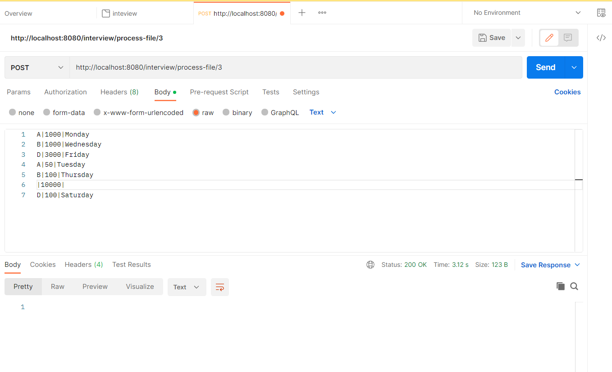

# Take Home Task

We would like to have you complete this task and we ask that you complete this on your own.  We are expecting you to be able to get this back to us before our next round of interviews on __________.
Please let me know if you have any questions.

--------------------------
This task simulates receiving streams of messages over a network and processing them efficiently.
The messages are received one at a time (serialized) so we are using a single producer,
but to possibly increase throughput, we want to use multiple processors.

We are asking you to use one thread to read the file one line at a time and a configurable
number of threads to handle processing messages.

A sample file (messages.txt) is included that contains
one message per line where values are delimited by '|'.

The first value in each line is the message ID.
- message ID is of type String
- message IDs can and will repeat
- number of unique IDs is unknown
- format of message IDs is unknown (ie. don't assume one character from A-Z)

The second value is how long it takes to process the message (in milliseconds) and the third value is the payload.
none of the values will contain the delimiter so you can assume there will at most be two '|' characters per line.

if Message ID is not present and processing time is present (|500|) then the producer needs to stop
producing for 500ms.  This simulates a pause in incoming messages.

The second value (the number of milliseconds processing will take) cannot be used for anything other than sleeping.
In a real world scenario, processing time or delays between messages will not be known and processing will take whatever time it takes.
So this value must not be used in any decision making part of the algorithm.
In the real world, there is no knowledge of when messages will stop coming in.
So we cannot use the end of file or the knowledge that there are no more messages as part of algorithm.

**** All messages with the same ID must be processed in the order they appear in the file. ****

So for example, if these are the messages in the file:

A|1000|Monday
B|1000|Wednesday
D|3000|Friday
A|50|Tuesday
B|100|Thursday
|10000|
D|100|Saturday

then 'Monday', 'Wednesday', 'Friday' can be processed at the same time independently of each other (because IDs are different),
and 'Tuesday', 'Thursday', 'Saturday' can be processed at the same time independently of each other (because IDs are different),
but 'Tuesday' must be processed after 'Monday' (same ID of 'A'),
and 'Thursday' after 'Wednesday' (same ID of 'B')
and 'Saturday' after 'Friday' (same ID of 'D')
The producer will pause for 10 seconds before sending 'Saturday' for processing.

Each line provides the value for how long the consumer should sleep to simulate the message processing time.

Write Spring boot microservice that exposes a REST POST endpoint which accepts a text file.
Other than Spring framework, do not use any third party libraries without asking if you can.
Do not use a Database.
The URI should also accept the number of consumers to use to process the file.
Example:
../interview/process-file/5
In the above example, 5 consumers will be used to process the file that will be sent with the HTTP POST request.

Rules for Processing the file:
You cannot sort the file, or read through the entire file before simulating the processing of the payload.
Must treat each line in the file as if you do not know the next line.

Include a Readme.txt describing the algorithm in detail so that it can be understood by developers and technical business analysts.
As part of the source code, please use comments to explain the design choices.

The REST call will not return anything in the body; the call will return 200 OK success.
but the Java console should output the following per line in the file.
PID: <PRODUCER_THREAD_ID>;  <ORIGINAL_MESSAGE>;  Thread: <CONSUMER_THREAD_ID>;  Start: <HH:mm:ss.SSS>;  End: <HH:mm:ss.SSS>;  Wait Time (ms): ##########

Wait Time - represents the number of milliseconds between the time the producer read the message to when the consumer started to process it.

(The below output sample is for formatting only. The accuracy of thread ids, order, start and end times may not be correct)
Output Sample:

PID: YY;  START: 09:12:10.000;  Consumers: 5;  File: messages.txt
PID: YY;  A|1000|Monday;	Thread: XX;  Start: 09:12:10.000;  End: 09:12:11.000;  Wait Time(ms): 0
PID: YY;  B|1000|Tuesday;   Thread: XX;  Start: 09:12:10.000;  End: 09:12:11.000;  Wait Time(ms): 0
PID: YY;  A|50|Wednesday;   Thread: XX;  Start: 09:12:11.000;  End: 09:12:11.050;  Wait Time(ms): 1000
PID: YY;  B|100|Thursday;   Thread: XX;  Start: 09:12:11.000;  End: 09:12:11.100;  Wait Time(ms): 1000
PID: YY;  D|3000|Friday;	Thread: XX;  Start: 09:12:10.000;  End: 09:12:13.000;  Wait Time(ms): 0
PID: YY;  D|100|Saturday;   Thread: XX;  Start: 09:12:23.000;  End: 09:12:23.100;  Wait Time(ms): 0
PID: YY;  END: 09:12:23.100

# Solution

Algorithm
There are 2 classes Producer, Consumer. Both classes implement Runnable interface and run in the same ExecutorService.
For each post request, we create new ExecutorService instance, because the pool size can be different. In the end we will shutdown them.
After creating the necessary objects, the file is read and each line is added to the queue (ConcurrentLinkedQueue) to the Producer.

Producer in a loop takes a line from the queue and submit the job to the new Consumer instance.
When there are no more rows in the queue, Producer waits for the consumers to complete its work, then notifies the main thread about this and the work is completed

For test 
1. run application.
2. open postman  and send request http://localhost:8080/interview/process-file/5

